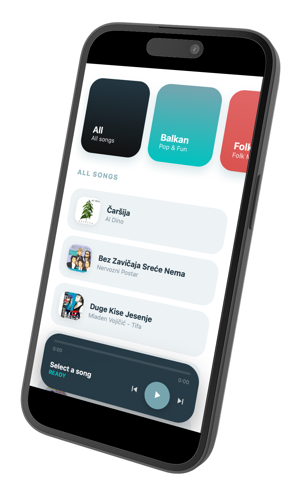

# Music Player 🎵

A modern, responsive web-based music player built with clean web technologies. This project features a dynamic playlist, interactive controls, and a sleek user interface.



## ✨ Features

- **Dynamic Playlist:** Songs are loaded dynamically from a `JSON` file.
- **Interactive Controls:** Play, pause, skip tracks, and volume adjustment.
- **Responsive Design:** Fully optimized for both desktop and mobile devices.
- **Progress Tracking:** Real-time progress bar and track duration display.
- **Visuals:** Automatic album art display for each track.

## 🛠️ Tech Stack

- **HTML5:** Semantic structure and audio elements.
- **CSS3:** Custom styling, animations, and Flexbox/Grid layout.
- **JavaScript (ES6):** Core logic for audio handling and DOM manipulation.
- **JSON:** Data storage for song metadata (title, artist, paths).

## 📂 File Structure

- `index.html` - Main entry point.
- `style.css` - All visual styles and layouts.
- `script.js` - The engine behind the player logic.
- `songs.json` - The database for your music list.
- `/music` - Folder for audio files and images.

## 🚀 Getting Started

1. **Clone the repository:**
   ```bash
   git clone https://github.com
   ```
2. **Open the project:**
   Simply open `index.html` in your web browser.

## 📝 JSON Data Example

To add new songs, update your `songs.json` using this format:

```json
[
  {
    "title": "Song Title",
    "artist": "Artist Name",
    "img": "music/images/cover.jpg",
    "src": "music/song.mp3"
  }
]
```

## 🤝 Contributing

Contributions are welcome! If you have ideas for new features or find any bugs, feel free to open an **Issue** or submit a **Pull Request**.

## 📄 License

This project is open source and available under the [MIT License](LICENSE).

